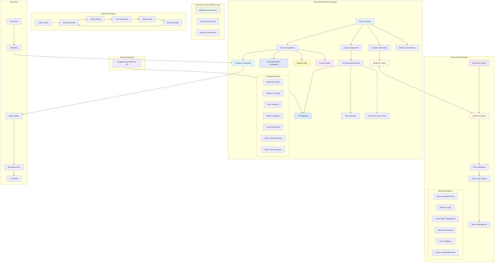
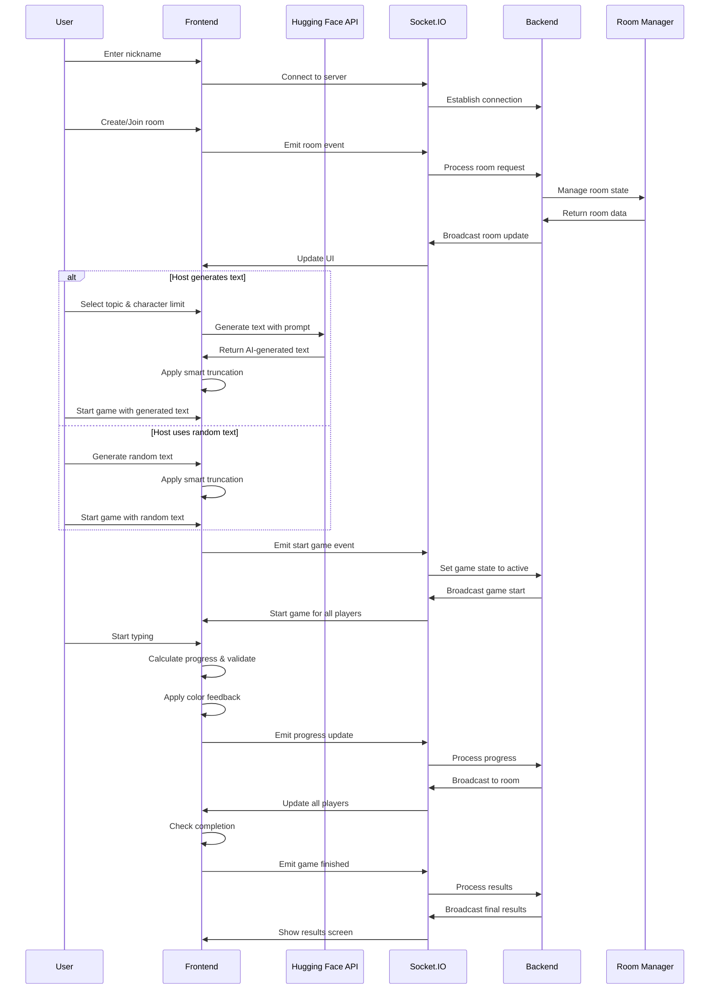
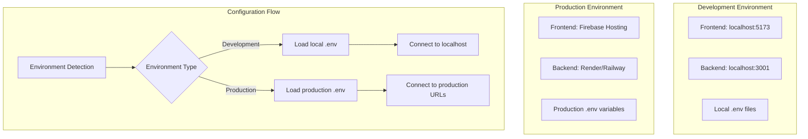
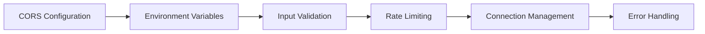
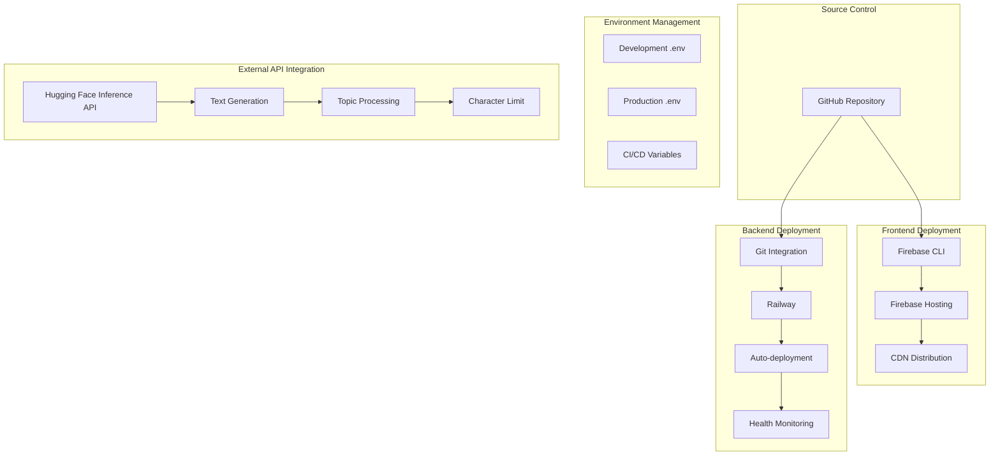

# CapyType Race - System Architecture

## Overview
This document provides a detailed architectural overview of the CapyType Race multiplayer typing game.

## System Architecture Diagram

## Component Interaction Flow

## Technology Stack Details

```mermaid
graph LR
    subgraph "Frontend Stack"
        A[React 18] --> B[TypeScript]
        B --> C[Vite]
        C --> D[Tailwind CSS]
        D --> E[Framer Motion]
        E --> F[Socket.IO Client]
        F --> G[Zustand]
        G --> H[Reusable Button Component]
        H --> I[Avatars Utility]
        I --> J[React Confetti]
        J --> K[Hugging Face Inference API]
        K --> L[Smart Text Truncation]
        L --> M[Asset Preloading]
    end
    
    subgraph "Backend Stack"
        N[Node.js] --> O[Express.js]
        O --> P[Socket.IO Server]
        P --> Q[TypeScript]
        Q --> R[CORS]
        R --> S[dotenv]
        S --> T[UUID Validation]
    end
    
    subgraph "Development Tools"
        U[ESLint] --> V[Prettier]
        V --> W[Git]
        W --> X[npm/yarn]
    end
    
    subgraph "Deployment"
        Y[Firebase Hosting] --> Z[Railway]
        Z --> AA[Environment Variables]
        AA --> AB[CI/CD Pipeline]
    end
```

## Environment Configuration

## Key Features Implementation

### Real-time Multiplayer
- WebSocket connections via Socket.IO
- Event-driven architecture
- Room-based player management
- Live progress synchronization

### Game Mechanics
- Character-by-character validation
- Real-time WPM calculation
- Error tracking and correction
- Progress percentage calculation

### State Management
- Zustand for client-side state
- In-memory room management on server
- Persistent connection handling
- Automatic reconnection logic

## Security Considerations

## Performance Optimizations

- Efficient state updates
- Debounced progress reporting
- Optimized re-renders
- Memory management for rooms
- Connection pooling

## Deployment Architecture

This architecture ensures scalability, maintainability, and real-time performance for the multiplayer typing game experience.

