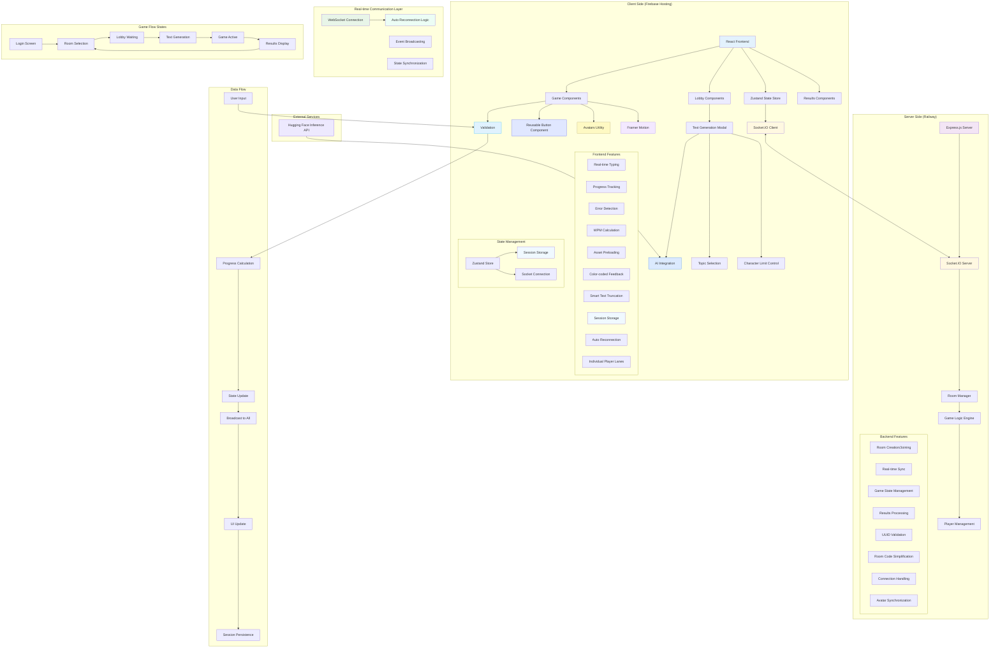
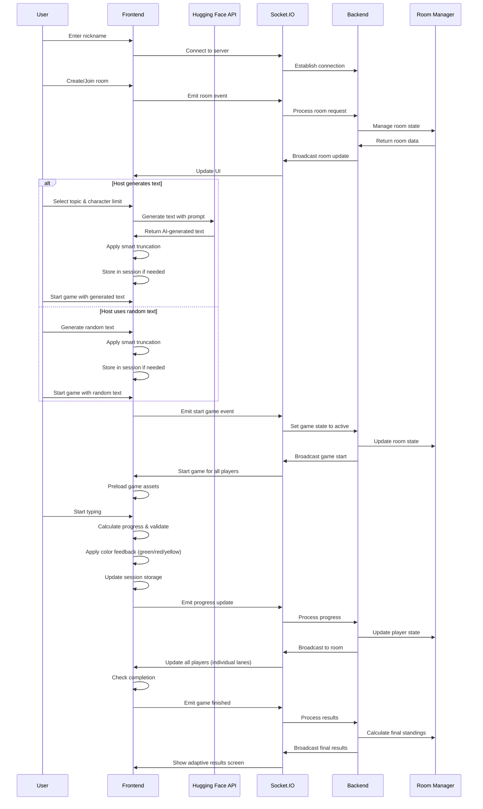
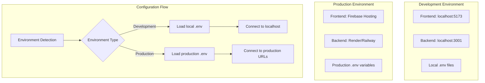
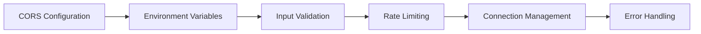
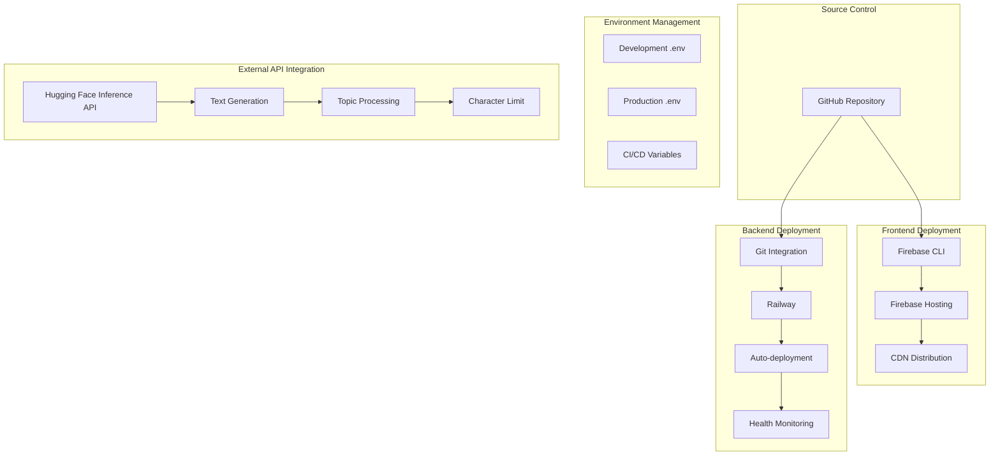

# CapyType Race - System Architecture

## Overview
This document provides a detailed architectural overview of the CapyType Race multiplayer typing game.

## System Architecture Diagram

## Component Interaction Flow

## Technology Stack Details

```mermaid
graph LR
    subgraph "Frontend Stack"
        A[React 18] --> B[TypeScript]
        B --> C[Vite]
        C --> D[Tailwind CSS]
        D --> E[Framer Motion]
        E --> F[Socket.IO Client]
        F --> G[Zustand]
        G --> H[Reusable Button Component]
        H --> I[Avatars Utility]
        I --> J[React Confetti]
        J --> K[Hugging Face Inference API]
        K --> L[Smart Text Truncation]
        L --> M[Asset Preloading]
        M --> N[Session Storage]
        N --> O[Auto Reconnection]
        O --> P[Individual Player Lanes]
        P --> Q[Color-coded Feedback]
    end
    
    subgraph "Backend Stack"
        R[Node.js] --> S[Express.js]
        S --> T[Socket.IO Server]
        T --> U[TypeScript]
        U --> V[CORS]
        V --> W[dotenv]
        W --> X[UUID Validation]
        X --> Y[Room Management]
        Y --> Z[Connection Handling]
        Z --> AA[Player Synchronization]
    end
    
    subgraph "Development Tools"
        BB[ESLint] --> CC[Prettier]
        CC --> DD[Git]
        DD --> EE[npm/yarn]
        EE --> FF[Hot Module Replacement]
        FF --> GG[TypeScript Compiler]
    end
    
    subgraph "Deployment & CI/CD"
        HH[Firebase Hosting] --> II[Railway]
        II --> JJ[Environment Variables]
        JJ --> KK[Automated Deployment]
        KK --> LL[Health Monitoring]
        LL --> MM[Auto-scaling]
    end
```

## Environment Configuration

## Key Features Implementation

### Real-time Multiplayer
- WebSocket connections via Socket.IO
- Event-driven architecture
- Room-based player management
- Live progress synchronization

### Game Mechanics
- Character-by-character validation
- Real-time WPM calculation
- Error tracking and correction
- Progress percentage calculation

### State Management
- Zustand for client-side state
- In-memory room management on server
- Persistent connection handling
- Automatic reconnection logic

## Security Considerations

## Performance Optimizations

- **Asset Preloading**: Eliminates game start latency by preloading images and components
- **Individual Player Lanes**: Reduces visual clutter and improves focus during gameplay
- **Efficient State Updates**: Optimized Zustand store with minimal re-renders
- **Debounced Progress Reporting**: Reduces unnecessary network traffic
- **Session Storage**: Persists user preferences across page refreshes
- **Smart Text Truncation**: Ensures text boundaries at sentence/word level
- **Color-coded Real-time Feedback**: Instant visual feedback without performance impact
- **Memory Management**: Automatic cleanup of rooms and connections
- **Connection Pooling**: Efficient WebSocket connection handling
- **Auto Reconnection**: Seamless recovery from network interruptions

## Deployment Architecture

## Recent Architectural Improvements (July 2025)

### Session Management
- **Persistent Avatar Selection**: User avatar/color choices are stored in session storage
- **Cross-session Continuity**: Avatar preferences persist across browser refreshes
- **Fallback Handling**: Graceful defaults when session data is unavailable

### Connection Reliability
- **Auto Reconnection Logic**: Automatic retry mechanism for dropped connections
- **Connection State Management**: Comprehensive tracking of socket connection states
- **Error Recovery**: Robust error handling with user-friendly feedback

### Game Performance
- **Asset Preloading Strategy**: Preloads game assets during lobby phase
- **Individual Lane Rendering**: Shows only current player's progress for better focus
- **Real-time Feedback System**: Color-coded typing feedback without performance impact

### State Architecture
- **Enhanced Zustand Store**: Improved state management with session persistence
- **Optimized Re-renders**: Minimal component updates through efficient state design
- **Memory Leak Prevention**: Proper cleanup of event listeners and connections

### Text Generation Pipeline
- **AI Integration**: Seamless integration with Hugging Face Inference API
- **Smart Truncation**: Boundary-aware text cutting at sentence/word boundaries
- **Fallback Mechanisms**: Multiple text sources with intelligent switching

This architecture ensures scalability, maintainability, and real-time performance for the multiplayer typing game experience.

