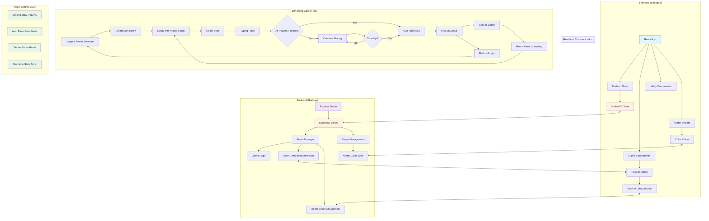
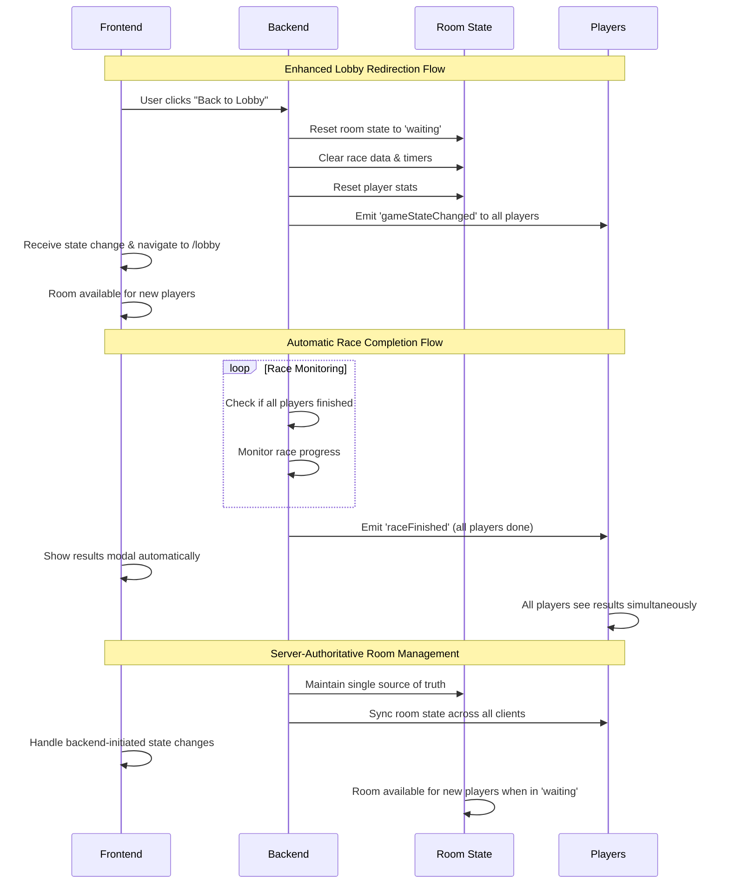

# CapyType Race 🏁

A real-time multiplayer typing game with a capybara theme where players race against each other to type text as quickly and accurately as possible.

## 🚀 Features

- **Real-time Multiplayer Racing** - Compete with friends in live typing races
- **Capybara-themed UI** - Cute and engaging interface with customizable avatar colors
- **Room-based Gameplay** - Create or join private rooms with readable room names
- **Avatar Customization** - Choose from 10 different capybara colors and personalities
- **Enhanced Visibility** - Improved UI transparency and color contrast
- **Live Progress Tracking** - See everyone's progress in real-time with vibrant player cards
- **Performance Metrics** - Track WPM, errors, and accuracy
- **Results Dashboard** - Compare your performance with others
- **Smart Lobby Redirection** - Seamless navigation back to functional lobbies
- **Automatic Race Completion** - Games end automatically when all players finish
- **Server-Authoritative Room Management** - Reliable room state management

## 🛠️ Tech Stack

- **Frontend**: React + TypeScript + Vite
- **Backend**: Node.js + Express + Socket.IO
- **State Management**: Zustand
- **Styling**: Tailwind CSS + Custom Styles
- **Animations**: Framer Motion
- **Real-time Communication**: Socket.IO
- **Hosting**: Firebase (Frontend) + Railway (Backend)

## 🏗️ Architecture & Game Flow



## 🔄 Lobby Redirection & Race Completion Flow



## 🚀 Quick Start

### Prerequisites
- Node.js (v14 or higher)
- npm or yarn

### Installation

1. **Clone the repository**
   ```bash
   git clone https://github.com/souzabruno01/CapyType-Race.git
   cd CapyType-Race/capytype
   ```

2. **Install dependencies**
   ```bash
   # Backend
   cd backend
   npm install
   
   # Frontend
   cd ../frontend
   npm install
   ```

3. **Configure environment variables**
   
   **Frontend (.env)**
   ```env
   VITE_BACKEND_URL=http://localhost:3001
   ```
   
   **Backend (.env)**
   ```env
   PORT=3001
   FRONTEND_URL=http://localhost:5173
   CORS_ORIGIN=http://localhost:5173,http://127.0.0.1:5173
   ```

4. **Start development servers**
   ```bash
   # Terminal 1 - Backend
   cd backend
   npm run dev
   
   # Terminal 2 - Frontend
   cd frontend
   npm run dev
   ```

5. **Open your browser**
   Navigate to `http://localhost:5173`

## 🌐 Production Deployment

### Frontend (Firebase)
```bash
cd frontend
npm run build
firebase deploy
```

### Backend (Render/Railway)
1. Connect your GitHub repository
2. Set environment variables:
   - `FRONTEND_URL`: Your Firebase hosting URL
   - `CORS_ORIGIN`: Your Firebase hosting URL + localhost for development

## 🎮 How to Play

1. **Enter your nickname** on the login screen
2. **Choose your capybara avatar** by clicking on the capybara face (10 colors available)
3. **Create a room** or **join an existing room** with a room ID
4. **Wait in the lobby** for other players to join (you'll see colorful player cards)
5. **Customize your color** anytime in the lobby using the edit button on your player card
6. **Start the game** when ready (room admin only)
7. **Type the displayed text** as fast and accurately as possible
8. **View results** and compare your performance with others

## 📊 Game Metrics

- **WPM (Words Per Minute)**: Typing speed calculation
- **Accuracy**: Percentage of correctly typed characters
- **Errors**: Number of mistakes made
- **Position**: Your rank among all players

## 🔧 Technical Implementation

### 🏗️ **Backend Architecture**

#### Socket.IO Events
```javascript
// New lobby redirection events
socket.on('returnToLobby', () => {
  // Reset room state to waiting
  // Clear race data and timers
  // Reset player statistics
  // Notify all players via gameStateChanged
});

// Automatic race completion
socket.on('playerFinished', (data) => {
  // Check if all players finished
  // Auto-end race when complete
  // Send raceFinished event to all players
});

// State synchronization
socket.emit('gameStateChanged', { gameState, reason });
```

#### Room State Management
```javascript
// Room states and transitions
const ROOM_STATES = {
  WAITING: 'waiting',     // Accepting new players
  PLAYING: 'playing',     // Game in progress
  FINISHED: 'finished'    // Race completed
};

// Automatic room availability logic
const isRoomAvailable = (room) => {
  return room.gameState === 'waiting' && room.players.length < MAX_PLAYERS;
};
```

### 🎮 **Frontend Implementation**

#### Game Store Integration
```typescript
// Enhanced useGameStore with new events
const gameStore = useGameStore();

// Handle server-initiated state changes
socket.on('gameStateChanged', ({ gameState, reason }) => {
  gameStore.setState({ gameState });
  if (gameState === 'waiting') {
    // Clear race data and reset player stats
    // Navigate to lobby if on game page
  }
});
```

#### Automatic Navigation
```typescript
// Smart navigation based on game state
useEffect(() => {
  if (gameState === 'waiting' && currentPath === '/game' && roomId) {
    navigate('/lobby'); // Auto-redirect to functional lobby
  }
}, [gameState, roomId, navigate]);
```

### 🔄 **Data Flow**

1. **Lobby Return Flow**:
   ```
   User clicks "Back to Lobby" 
   → Frontend emits 'returnToLobby'
   → Backend resets room state
   → Backend notifies all players
   → Frontend auto-navigates to lobby
   → Room available for new players
   ```

2. **Race Completion Flow**:
   ```
   Player finishes typing
   → Backend checks all player status
   → If all finished: emit 'raceFinished'
   → All players show results modal
   → Players can return to lobby or login
   ```

## 🔧 Configuration

### Environment Variables

| Variable | Description | Default |
|----------|-------------|---------|
| `VITE_BACKEND_URL` | Backend server URL | `http://localhost:3001` |
| `PORT` | Backend server port | `3001` |
| `FRONTEND_URL` | Frontend URL for CORS | `http://localhost:5173` |
| `CORS_ORIGIN` | Allowed CORS origins | `localhost URLs` |

## 🤝 Contributing

1. Fork the repository
2. Create your feature branch (`git checkout -b feature/amazing-feature`)
3. Commit your changes (`git commit -m 'Add some amazing feature'`)
4. Push to the branch (`git push origin feature/amazing-feature`)
5. Open a Pull Request

## 📝 License

This project is licensed under the MIT License - see the [LICENSE](LICENSE) file for details.

## 🐛 Known Issues & Solutions

### "Failed to connect to server"
- **Cause**: Backend URL misconfiguration
- **Solution**: Update `VITE_BACKEND_URL` in frontend `.env` file

### CORS Errors
- **Cause**: Frontend domain not allowed in backend CORS
- **Solution**: Add your domain to `CORS_ORIGIN` in backend `.env` file

## 🚀 Recent Updates

### 🎯 **Major Feature Release (July 2025)**

#### 🔄 **Smart Lobby Redirection System**
- ✅ **Functional "Back to Lobby" Button** - Players are now correctly redirected to working lobbies
- ✅ **Server-Side Room Reset** - Backend properly resets room state to 'waiting' when returning to lobby
- ✅ **Room Availability Logic** - Rooms are available for new players only when not in active game state
- ✅ **Real-time State Synchronization** - All players receive instant updates when room state changes

#### 🏁 **Automatic Race Completion**
- ✅ **All-Players-Finished Detection** - Games automatically end when every player completes typing
- ✅ **Instant Results Display** - Results modal appears immediately for all players simultaneously
- ✅ **Smart Race Monitoring** - Backend continuously monitors player completion status
- ✅ **Enhanced User Experience** - No more waiting around when everyone finishes early

#### 🛠️ **Backend Enhancements**
- ✅ **New Socket Events**:
  - `returnToLobby` - Handles lobby returns with proper room reset
  - `gameStateChanged` - Notifies clients of server-initiated state changes
- ✅ **Room State Management** - Server-authoritative room state with automatic cleanup
- ✅ **Race Timer Management** - Proper cleanup of race timers and data
- ✅ **Player Statistics Reset** - Automatic player stat reset when returning to lobby

#### 🎮 **Frontend Improvements**
- ✅ **Enhanced Game Store** - New event handlers for backend state changes
- ✅ **Automatic Navigation** - Smart navigation when game state changes
- ✅ **TypeScript Improvements** - Fixed compilation errors and improved type safety
- ✅ **Component Compatibility** - Updated lobby components for better prop handling

#### 🔧 **Technical Improvements**
- ✅ **Improved Error Handling** - Better TypeScript error resolution
- ✅ **Component Prop Fixes** - Resolved PlayerGrid and TextGenerationModal prop issues
- ✅ **Hook Enhancements** - Updated useTextGeneration hook with missing properties
- ✅ **Build Process** - Fixed compilation errors for successful deployment

### 📋 **Previous Updates**

- ✅ **Enhanced UI Visibility** - Improved transparency for login card and player cards in lobby
- ✅ **Avatar Customization** - Added 10 capybara color options with real-time color picker
- ✅ **Better Player Cards** - Increased color opacity for better visibility on the lobby board
- ✅ **Railway Deployment** - Optimized backend deployment configuration
- ✅ **Improved UX** - Better color contrast and visual feedback
- ✅ **Real-time Color Sync** - Avatar colors update instantly across all connected players
- ✅ **Fixed environment variable configuration**
- ✅ **Updated CORS settings for production**
- ✅ **Improved error handling and connection stability**

## 🌟 Key Features Deep Dive

### 🎯 **Smart Lobby System**
The lobby system now provides a seamless experience with:
- **Intelligent Room States**: Rooms automatically transition between waiting, playing, and finished states
- **New Player Support**: Rooms only accept new players when in waiting state
- **Real-time Updates**: All players stay synchronized with server state changes
- **Graceful Transitions**: Smooth navigation between game states

### 🏃‍♂️ **Race Completion Logic**
Enhanced race experience featuring:
- **Automatic Detection**: Server monitors all players and ends race when everyone finishes
- **Fair Results**: All players see results simultaneously regardless of finish time
- **Timer Management**: Proper cleanup prevents race state conflicts
- **Instant Feedback**: Results appear immediately when conditions are met

### 🔧 **Server-Authoritative Architecture**
Reliable multiplayer experience through:
- **Single Source of Truth**: Backend maintains authoritative game state
- **Event-Driven Communication**: Efficient Socket.IO event system
- **State Synchronization**: Frontend automatically updates based on server events
- **Error Recovery**: Robust handling of connection issues and state conflicts

---

Made with ❤️ and 🐹 by [Bruno Souza](https://github.com/souzabruno01)

