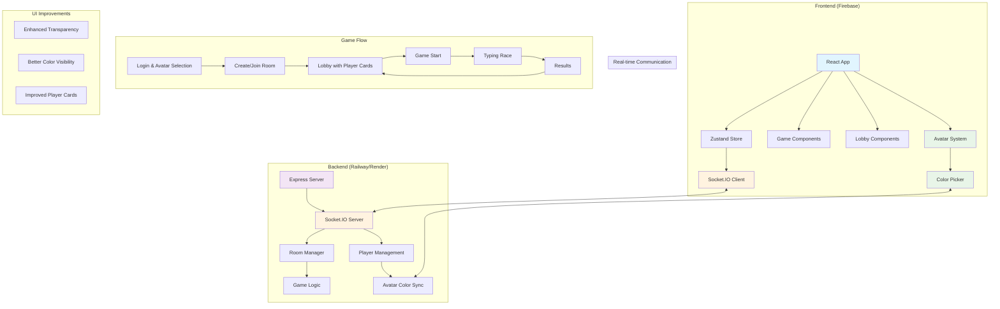

# CapyType Race 🏁

A real-time multiplayer typing game with a capybara theme where players race against each other to type text as quickly and accurately as possible.

## 🚀 Features

- **Real-time Multiplayer Racing** - Compete with friends in live typing races
- **Capybara-themed UI** - Cute and engaging interface with customizable avatar colors
- **Room-based Gameplay** - Create or join private rooms with readable room names
- **Avatar Customization** - Choose from 10 different capybara colors and personalities
- **Enhanced Visibility** - Improved UI transparency and color contrast
- **Live Progress Tracking** - See everyone's progress in real-time with vibrant player cards
- **Performance Metrics** - Track WPM, errors, and accuracy
- **Results Dashboard** - Compare your performance with others

## 🛠️ Tech Stack

- **Frontend**: React + TypeScript + Vite
- **Backend**: Node.js + Express + Socket.IO
- **State Management**: Zustand
- **Styling**: Tailwind CSS
- **Animations**: Framer Motion
- **Hosting**: Firebase (Frontend) + Render/Railway (Backend)

## 🏗️ Architecture



## 🚀 Quick Start

### Prerequisites
- Node.js (v14 or higher)
- npm or yarn

### Installation

1. **Clone the repository**
   ```bash
   git clone https://github.com/souzabruno01/CapyType-Race.git
   cd CapyType-Race/capytype
   ```

2. **Install dependencies**
   ```bash
   # Backend
   cd backend
   npm install
   
   # Frontend
   cd ../frontend
   npm install
   ```

3. **Configure environment variables**
   
   **Frontend (.env)**
   ```env
   VITE_BACKEND_URL=http://localhost:3001
   ```
   
   **Backend (.env)**
   ```env
   PORT=3001
   FRONTEND_URL=http://localhost:5173
   CORS_ORIGIN=http://localhost:5173,http://127.0.0.1:5173
   ```

4. **Start development servers**
   ```bash
   # Terminal 1 - Backend
   cd backend
   npm run dev
   
   # Terminal 2 - Frontend
   cd frontend
   npm run dev
   ```

5. **Open your browser**
   Navigate to `http://localhost:5173`

## 🌐 Production Deployment

### Frontend (Firebase)
```bash
cd frontend
npm run build
firebase deploy
```

### Backend (Render/Railway)
1. Connect your GitHub repository
2. Set environment variables:
   - `FRONTEND_URL`: Your Firebase hosting URL
   - `CORS_ORIGIN`: Your Firebase hosting URL + localhost for development

## 🎮 How to Play

1. **Enter your nickname** on the login screen
2. **Choose your capybara avatar** by clicking on the capybara face (10 colors available)
3. **Create a room** or **join an existing room** with a room ID
4. **Wait in the lobby** for other players to join (you'll see colorful player cards)
5. **Customize your color** anytime in the lobby using the edit button on your player card
6. **Start the game** when ready (room admin only)
7. **Type the displayed text** as fast and accurately as possible
8. **View results** and compare your performance with others

## 📊 Game Metrics

- **WPM (Words Per Minute)**: Typing speed calculation
- **Accuracy**: Percentage of correctly typed characters
- **Errors**: Number of mistakes made
- **Position**: Your rank among all players

## 🔧 Configuration

### Environment Variables

| Variable | Description | Default |
|----------|-------------|---------|
| `VITE_BACKEND_URL` | Backend server URL | `http://localhost:3001` |
| `PORT` | Backend server port | `3001` |
| `FRONTEND_URL` | Frontend URL for CORS | `http://localhost:5173` |
| `CORS_ORIGIN` | Allowed CORS origins | `localhost URLs` |

## 🤝 Contributing

1. Fork the repository
2. Create your feature branch (`git checkout -b feature/amazing-feature`)
3. Commit your changes (`git commit -m 'Add some amazing feature'`)
4. Push to the branch (`git push origin feature/amazing-feature`)
5. Open a Pull Request

## 📝 License

This project is licensed under the MIT License - see the [LICENSE](LICENSE) file for details.

## 🐛 Known Issues & Solutions

### "Failed to connect to server"
- **Cause**: Backend URL misconfiguration
- **Solution**: Update `VITE_BACKEND_URL` in frontend `.env` file

### CORS Errors
- **Cause**: Frontend domain not allowed in backend CORS
- **Solution**: Add your domain to `CORS_ORIGIN` in backend `.env` file

## 🚀 Recent Updates

- ✅ **Enhanced UI Visibility** - Improved transparency for login card and player cards in lobby
- ✅ **Avatar Customization** - Added 10 capybara color options with real-time color picker
- ✅ **Better Player Cards** - Increased color opacity for better visibility on the lobby board
- ✅ **Railway Deployment** - Optimized backend deployment configuration
- ✅ **Improved UX** - Better color contrast and visual feedback
- ✅ **Real-time Color Sync** - Avatar colors update instantly across all connected players
- ✅ **Fixed environment variable configuration**
- ✅ **Updated CORS settings for production**
- ✅ **Resolved TypeScript compilation errors**
- ✅ **Improved error handling and connection stability**

---

Made with ❤️ and 🐹 by [Bruno Souza](https://github.com/souzabruno01)

