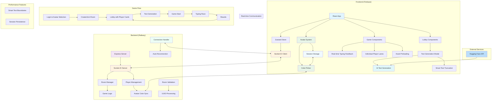

# CapyType Race 🏁

A real-time multiplayer typing game with a capybara theme where players race against each other to type text as quickly and accurately as possible.

## 🚀 Features

- **Real-time Multiplayer Racing** - Compete with friends in live typing races
- **Capybara-themed UI** - Cute and engaging interface with customizable avatar colors
- **Room-based Gameplay** - Create or join private rooms with readable room names
- **Avatar Customization** - Choose from 10 different capybara colors and personalities
- **AI-powered Text Generation** - Host can generate race text using advanced AI with topic prompts and multiple character limits (50-2000)
- **Character Limit Control** - Set precise character limits for race text with extensive options from 50 to 2000 characters
- **Smart Text Truncation** - Ensures text always ends at logical boundaries (sentence/word) for all text sources
- **Enhanced AI Integration** - Multiple AI providers (Groq, Together AI, Hugging Face) for reliable text generation
- **Individual Player Lanes** - Focus on your own performance during the race
- **Real-time Color Feedback** - Instantly see typing correctness with color highlighting
- **Performance Metrics** - Track WPM, errors, and accuracy
- **Results Dashboard** - Compare your performance with others

## 🛠️ Tech Stack

- **Frontend**: React + TypeScript + Vite
- **Backend**: Node.js + Express + Socket.IO
- **State Management**: Zustand with persistent session storage
- **Styling**: Tailwind CSS
- **Animations**: Framer Motion
- **UI Components**: Custom reusable components with TypeScript
- **AI Text Generation**: Hugging Face Inference API
- **Real-time Communication**: WebSocket with Socket.IO
- **Asset Management**: Vite with optimized bundling and preloading
- **Hosting**: Firebase (Frontend) + Railway (Backend)
- **Version Control**: Git + GitHub with automated CI/CD

## 🏗️ Architecture



## 🚀 Quick Start

### Prerequisites
- Node.js (v14 or higher)
- npm or yarn

### Installation

1. **Clone the repository**
   ```bash
   git clone https://github.com/souzabruno01/CapyType-Race.git
   cd CapyType-Race/capytype
   ```

2. **Install dependencies**
   ```bash
   # Backend
   cd backend
   npm install
   
   # Frontend
   cd ../frontend
   npm install
   ```

3. **Configure environment variables**
   
   **Frontend (.env)**
   ```env
   VITE_BACKEND_URL=http://localhost:3001
   
   # Optional: For enhanced AI text generation
   # Get free API keys from:
   # - Groq: https://console.groq.com/
   # - Together AI: https://api.together.xyz/
   VITE_AI_API_KEY=your_api_key_here
   ```
   
   **Backend (.env)**
   ```env
   PORT=3001
   FRONTEND_URL=http://localhost:5173
   CORS_ORIGIN=http://localhost:5173,http://127.0.0.1:5173
   ```

4. **Start development servers**
   ```bash
   # Terminal 1 - Backend
   cd backend
   npm run dev
   
   # Terminal 2 - Frontend
   cd frontend
   npm run dev
   ```

5. **Open your browser**
   Navigate to `http://localhost:5173`

## 🌐 Production Deployment

### Frontend (Firebase)
```bash
cd frontend
npm run build
firebase deploy
```

### Backend (Render/Railway)
1. Connect your GitHub repository
2. Set environment variables:
   - `FRONTEND_URL`: Your Firebase hosting URL
   - `CORS_ORIGIN`: Your Firebase hosting URL + localhost for development

## 🎮 How to Play

1. **Enter your nickname** on the login screen
2. **Choose your capybara avatar** by clicking on the capybara face (10 colors available)
3. **Create a room** or **join an existing room** with a room ID
4. **Wait in the lobby** for other players to join (you'll see colorful player cards)
5. **Customize your color** anytime in the lobby using the edit button on your player card
6. **Generate race text** (host only) - Choose a topic and character limit or use random text
7. **Start the game** when ready (room admin only)
8. **Type the displayed text** as fast and accurately as possible (green for correct, red for errors)
9. **View results** and compare your performance with others

## 📊 Game Metrics

- **WPM (Words Per Minute)**: Typing speed calculation
- **Accuracy**: Percentage of correctly typed characters
- **Errors**: Number of mistakes made
- **Position**: Your rank among all players

## 🔧 Configuration

### Environment Variables

| Variable | Description | Default |
|----------|-------------|---------|
| `VITE_BACKEND_URL` | Backend server URL | `http://localhost:3001` |
| `PORT` | Backend server port | `3001` |
| `FRONTEND_URL` | Frontend URL for CORS | `http://localhost:5173` |
| `CORS_ORIGIN` | Allowed CORS origins | `localhost URLs` |

## 🤝 Contributing

1. Fork the repository
2. Create your feature branch (`git checkout -b feature/amazing-feature`)
3. Commit your changes (`git commit -m 'Add some amazing feature'`)
4. Push to the branch (`git push origin feature/amazing-feature`)
5. Open a Pull Request

## 📝 License

This project is licensed under the MIT License - see the [LICENSE](LICENSE) file for details.

## 🐛 Known Issues & Solutions

### "Failed to connect to server"
- **Cause**: Backend URL misconfiguration or server unavailable
- **Solution**: Update `VITE_BACKEND_URL` in frontend `.env` file, check server status

### CORS Errors
- **Cause**: Frontend domain not allowed in backend CORS
- **Solution**: Add your domain to `CORS_ORIGIN` in backend `.env` file

### "Invalid room code" when trying to join
- **Cause**: Room does not exist, has been closed, or expired
- **Solution**: Double-check the room code or create a new room

### Avatar/Color not persisting
- **Cause**: Session storage cleared or browser restrictions
- **Solution**: Re-select avatar/color; settings will persist for future sessions

### Socket connection drops during game
- **Cause**: Network instability or server restart
- **Solution**: App will attempt auto-reconnection; refresh page if issues persist

### Text generation fails
- **Cause**: Hugging Face API rate limits or connectivity issues
- **Solution**: Try again after a moment or use random text generation as fallback

## 🚀 Recent Updates (July 2025)

- ✅ **Performance Optimization** - Implemented asset preloading to eliminate game start latency
- ✅ **Host-Driven Text Generation** - Moved text generation to lobby (host-only) with real AI integration
- ✅ **Individual Player Lanes** - Updated to show only the current player's lane during the race
- ✅ **Real-time Typing Feedback** - Added color-coded feedback (green, red, yellow) and error counting
- ✅ **Adaptive Results Modal** - Redesigned to be responsive and visually separated
- ✅ **Hugging Face AI Integration** - Using real AI text generation with topic and character limit options
- ✅ **Smart Text Truncation** - Implemented boundary-aware text truncation (sentence/word) for all text sources
- ✅ **Room Validation Fix** - Simplified room joining with plain UUIDs for better reliability
- ✅ **Enhanced Error Handling** - Improved validation and error handling for room joining
- ✅ **Backend Auto-deployment** - Updated Railway configuration for automatic deployment on git push
- ✅ **Enhanced AI Text Generation** - Implemented multiple AI providers (Groq, Together AI, Hugging Face) with topic-specific generation
- ✅ **Extended Character Limits** - Added support for text lengths from 50 to 2000 characters with improved selection UI
- ✅ **Smart Random Text** - Random text now generated by AI instead of stored templates
- ✅ **Improved Modal Layout** - Better alignment, spacing, and responsive design for text generation modal
- ✅ **Topic-Specific Generation** - AI now properly generates content about specified topics (e.g., "headphones", "technology")
- ✅ **Enhanced Fallback System** - Comprehensive topic-aware fallback text when AI services are unavailable

---

Made with ❤️ and 🐹 by [Bruno Souza](https://github.com/souzabruno01)

